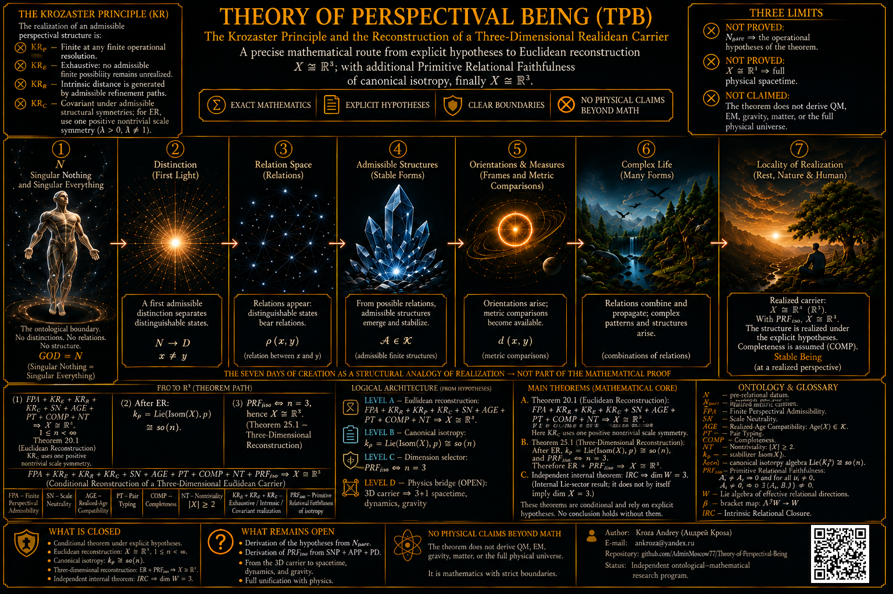

# Theory of Perspectival Being (TPB)

## A Lie-Algebraic Three-Dimensional Selector

**Author:** Kroza Andrey (Андрей Кроза)  
**E-mail:** ankroza@yandex.ru  
**Repository:** [AdminMoscow77/Theory-of-Perspectival-Being](https://github.com/AdminMoscow77/Theory-of-Perspectival-Being)  
**Status:** Independent ontological–mathematical research program.

---


# Table of contents

- [Read this first](#read-this-first)
- [Коротко по-русски](#коротко-по-русски)
- [1. Ontological boundary N](#1-ontological-boundary-n)
  - [1.1. The Krozaster Principle (KrP)](#11-the-krozaster-principle-krp)
- [2. Algebraic setup](#2-algebraic-setup)
- [3. Finite-dimensional sanity check](#3-finite-dimensional-sanity-check)
- [4. Main upper theorem](#4-main-upper-theorem)
- [5. Exact three-dimensional selector](#5-exact-three-dimensional-selector)
- [6. Classification of the surviving algebra](#6-classification-of-the-surviving-algebra)
- [7. Boundary examples](#7-boundary-examples)
- [8. TPB interpretation: open bridges](#8-tpb-interpretation-open-bridges)
- [9. Conditional relation to physical space](#9-conditional-relation-to-physical-space)
- [10. Potential relevance to mathematical physics](#10-potential-relevance-to-mathematical-physics)
- [11. What is proved](#11-what-is-proved)
- [12. What is not proved](#12-what-is-not-proved)
- [13. Logical architecture](#13-logical-architecture)
- [14. Current research target](#14-current-research-target)
- [References](#references)
- [Author](#author)

---


# Read this first

This README separates three different claims that must not be confused:

1. **Pure mathematics:** a theorem about real Lie algebras.
2. **TPB interpretation:** why a post-perspectival carrier should satisfy the theorem's hypotheses.
3. **Physics:** whether that carrier is actually the tangent space of physical space.

The proved mathematical core is:

```math
\boxed{
\ker\!\left(\beta:\Lambda^2V\to V\right)=0
\Longrightarrow
\dim_{\mathbb R}V\le3.
}
```

No finite-dimensionality assumption is made.

If, in addition,

```math
\boxed{
[[V,V],[V,V]]\neq0,
}
```

then

```math
\boxed{
\dim_{\mathbb R}V=3.
}
```

Consequently,

```math
\boxed{
V\cong\mathfrak{so}(3)
\quad\text{or}\quad
V\cong\mathfrak{sl}(2,\mathbb R).
}
```

This does **not** by itself prove that physical space is three-dimensional.

---

## Коротко по-русски

Математически доказано следующее.

Если у вещественной алгебры Ли \(V\) каноническая скобка

```math
\beta:\Lambda^2V\to V
```

инъективна, то

```math
\dim_{\mathbb R}V\le3.
```

Если дополнительно

```math
[[V,V],[V,V]]\neq0,
```

то остаётся ровно

```math
\dim_{\mathbb R}V=3,
```

а сама алгебра обязана быть

```math
\mathfrak{so}(3)
\quad\text{или}\quad
\mathfrak{sl}(2,\mathbb R).
```

Это строгий **алгебраический селектор числа 3**.

Но переход

```math
V\cong T_pX
```

к физическому пространству отдельно не доказан.  
Также пока отдельно не выведены из TPB сами два условия селектора.

---

# 1. Ontological boundary N

TPB uses the symbol

```math
N
```

as a meta-level name for a limiting pre-mathematical state described in words as
*Singular Nothing / Singular Everything*.

No mathematical structure on \(N\) is assumed in this README.

In particular, \(N\) is not assigned:

- elements;
- sets;
- relations;
- algebraic operations;
- topology;
- metric;
- causality;
- dimension.

The notation

```math
N\ \big|\ \mathrm{KrP}
```

is only a schematic boundary marker.

The Lie-algebraic mathematics begins on the post-KrP side.

## 1.1. The Krozaster Principle (KrP)

The **Krozaster Principle (KrP)** is the TPB realization principle governing how an admissible perspectival structure is carried into realized structure.

In this README, KrP is specified by four **conceptual clauses**:

- **\(KR_F\) — Finite Perspective:** every admissible perspective has only finite operational content at any finite stage or finite resolution.
- **\(KR_E\) — Exhaustive Admissible Extension:** an admissible finite extension is not omitted from the realized closure.
- **\(KR_R\) — Intrinsic Refinement:** refinement is determined by admissible internal distinctions of the realized structure rather than by an externally imposed geometry.
- **\(KR_C\) — Structural Covariance:** admissible changes of perspectival representation preserve the structural content relevant to realization.

These four labels are a decomposition of the conceptual content of KrP; **no algebraic addition or other mathematical operation between them is intended**.

No spatial dimension, preferred Lie algebra, or numerical value of \(\dim V\) is explicitly stipulated by these clauses.

At the present stage, these clauses are **not used as premises in the Lie-algebraic proof below**. Their mathematical relation to the selector hypotheses remains an open problem.

Most importantly, KrP must not be confused with the hypotheses of the Lie-algebraic selector:

```math
\boxed{
\mathrm{KrP}
\not\equiv
\left\{
\ker\beta=0,\;
[[V,V],[V,V]]\neq0
\right\}.
}
```

The present README does **not** prove

```math
\mathrm{KrP}
\Longrightarrow
\ker\beta=0
```

or

```math
\mathrm{KrP}
\Longrightarrow
[[V,V],[V,V]]\neq0.
```

Those implications remain the principal open foundational bridges between the TPB realization principle and the proved three-dimensional Lie-algebraic selector.

---

# 2. Algebraic setup

Let \(V\) be a real Lie algebra.

No finite-dimensionality assumption is made.

Define the canonical linear bracket map

```math
\boxed{
\beta:\Lambda^2V\to V,
\qquad
\beta(x\wedge y)=[x,y].
}
\tag{2.1}
```

Here \(\Lambda^2V\) is the **algebraic exterior square**.

The upper selector is

```math
\boxed{
\ker\beta=\{0\}.
}
\tag{U}
```

This condition is strong.

It implies, in particular,

```math
[x,y]=0
\Longrightarrow
x\wedge y=0,
```

so two linearly independent elements cannot commute.

More generally, it forbids any nonzero element

```math
\Omega\in\Lambda^2V
```

for which

```math
\beta(\Omega)=0.
```

---

# 3. Finite-dimensional sanity check

If

```math
n:=\dim V<\infty,
```

then injectivity of \(\beta\) immediately gives

```math
\dim\Lambda^2V\le\dim V.
```

Since

```math
\dim\Lambda^2V=\frac{n(n-1)}2,
```

we obtain

```math
\frac{n(n-1)}2\le n.
```

For \(n>0\),

```math
n\le3.
```

Thus the finite-dimensional case is elementary.

The substantial point is that the same upper bound remains true **without assuming finite-dimensionality**.

---

# 4. Main upper theorem

## Theorem 4.1

Let \(V\) be a real Lie algebra.

If

```math
\ker\beta=0,
```

then

```math
\boxed{
\dim_{\mathbb R}V\le3.
}
```

No finite-dimensionality assumption is required.

## Proof

Assume for contradiction that

```math
\dim V\ge4.
```

Choose linearly independent

```math
x,y,z\in V.
```

The Jacobi identity gives

```math
[x,[y,z]]+[y,[z,x]]+[z,[x,y]]=0.
```

Using the definition of \(\beta\),

```math
\beta\!\left(
x\wedge[y,z]
+y\wedge[z,x]
+z\wedge[x,y]
\right)=0.
```

Since \(\beta\) is injective,

```math
\boxed{
x\wedge[y,z]
+y\wedge[z,x]
+z\wedge[x,y]
=0.
}
\tag{4.1}
```

Let

```math
W:=\mathrm{span}\{x,y,z\}.
```

Work inside the finite-dimensional subspace

```math
U
:=
W+\mathrm{span}\{[x,y],[y,z],[z,x]\}.
```

Then

```math
\dim U\le6.
```

Choose a vector-space complement \(C\) of \(W\) in \(U\):

```math
U=W\oplus C.
```

The exterior square decomposes as

```math
\boxed{
\Lambda^2U
=
\Lambda^2W
\oplus
(W\wedge C)
\oplus
\Lambda^2C.
}
\tag{4.2}
```

The mixed summand is naturally isomorphic to a tensor product:

```math
W\wedge C\cong W\otimes C,
\qquad
w\wedge c\longmapsto w\otimes c.
```

Write

```math
[y,z]=a_W+a_C,
\qquad
[z,x]=b_W+b_C,
\qquad
[x,y]=c_W+c_C,
```

with

```math
a_W,b_W,c_W\in W,
\qquad
a_C,b_C,c_C\in C.
```

Equation (4.1) lies in \(\Lambda^2U\).

Its component in the direct summand \(W\wedge C\) is

```math
x\wedge a_C
+y\wedge b_C
+z\wedge c_C
=0.
```

Under

```math
W\wedge C\cong W\otimes C,
```

this becomes

```math
x\otimes a_C
+y\otimes b_C
+z\otimes c_C
=0.
```

Since \(x,y,z\) form a basis of \(W\),

```math
W\otimes C\cong C^{\oplus3},
```

and uniqueness of coordinates gives

```math
a_C=b_C=c_C=0.
```

Therefore

```math
[x,y],[y,z],[z,x]\in W.
```

So every three-dimensional subspace spanned by three independent vectors is
closed under the Lie bracket.

Now choose four independent vectors

```math
x,y,z,w.
```

Then

```math
[x,y]\in\mathrm{span}\{x,y,z\}
```

and

```math
[x,y]\in\mathrm{span}\{x,y,w\}.
```

Hence

```math
[x,y]
\in
\mathrm{span}\{x,y,z\}
\cap
\mathrm{span}\{x,y,w\}
=
\mathrm{span}\{x,y\}.
```

Thus

```math
\boxed{
[x,y]\in\mathrm{span}\{x,y\}
\qquad
\forall x,y\in V.
}
\tag{4.3}
```

We now reduce the bracket to a single linear functional.

Fix \(0\neq x\in V\).

By (4.3), \(\mathrm{ad}_x\) induces a linear operator

```math
T_x:V/\mathbb Rx\to V/\mathbb Rx,
\qquad
T_x(\bar y)=\overline{[x,y]}.
```

Every nonzero vector of \(V/\mathbb Rx\) is an eigenvector of \(T_x\).

Since

```math
\dim(V/\mathbb Rx)\ge3,
```

a linear operator for which every nonzero vector is an eigenvector must be a scalar multiple
of the identity.

Indeed, if \(u,v\) are independent and

```math
Tu=au,
\qquad
Tv=bv,
\qquad
T(u+v)=c(u+v),
```

then linearity gives

```math
au+bv=cu+cv,
```

hence

```math
a=b=c.
```

Therefore there exists a scalar \(\varphi(x)\) such that

```math
T_x=\varphi(x)\mathrm{id}.
```

Define

```math
\varphi(0):=0.
```

For \(a\neq0\),

```math
\mathbb R(ax)=\mathbb Rx
```

and, on the same quotient,

```math
T_{ax}=aT_x.
```

Therefore

```math
\varphi(ax)=a\varphi(x).
```

The same identity is trivial for \(a=0\).

Hence \(\varphi\) is homogeneous.

Now take linearly independent \(x,y\).

From the definition of \(T_x\),

```math
[x,y]-\varphi(x)y\in\mathbb Rx.
```

Interchanging \(x\) and \(y\) and using antisymmetry gives

```math
\boxed{
[x,y]
=
\varphi(x)y-\varphi(y)x
}
\tag{4.4}
```

for every linearly independent pair \(x,y\).

It remains to prove additivity.

Let \(x,z\in V\).

If \(x\) and \(z\) are linearly dependent, then additivity follows immediately
from homogeneity.

Assume therefore that \(x,z\) are linearly independent.

Since \(\dim V\ge4\), choose

```math
y\notin\mathrm{span}\{x,z\}.
```

Then \(x,y\), \(z,y\), and \(x+z,y\) are all linearly independent pairs.

By bilinearity,

```math
[x+z,y]=[x,y]+[z,y].
```

Using (4.4) on all three pairs,

```math
\varphi(x+z)y-\varphi(y)(x+z)
=
(\varphi(x)+\varphi(z))y-\varphi(y)(x+z).
```

Therefore

```math
\varphi(x+z)=\varphi(x)+\varphi(z).
```

Thus

```math
\boxed{
\varphi\in V^*.
}
```

Now (4.4) also holds for dependent pairs.

Indeed, if \(y=ax\), then homogeneity gives

```math
\varphi(y)=a\varphi(x),
```

and therefore

```math
\varphi(x)y-\varphi(y)x
=
a\varphi(x)x-a\varphi(x)x
=
0
=
[x,y].
```

Hence, for all \(x,y\in V\),

```math
\boxed{
[x,y]
=
\varphi(x)y-\varphi(y)x.
}
\tag{4.5}
```

Because

```math
\dim V\ge4,
```

the kernel of the linear functional

```math
\varphi:V\to\mathbb R
```

contains two linearly independent vectors \(u,v\).

Then

```math
[u,v]
=
\varphi(u)v-\varphi(v)u
=
0,
```

while

```math
u\wedge v\neq0.
```

Therefore

```math
\beta(u\wedge v)=0
```

with

```math
u\wedge v\neq0,
```

contradicting injectivity of \(\beta\).

Hence

```math
\boxed{
\dim_{\mathbb R}V\le3.
}
```

```math
\boxed{\square}
```

---

# 5. Exact three-dimensional selector

Injectivity alone does not force dimension exactly three.

For example, the two-dimensional affine Lie algebra

```math
V=\mathrm{span}\{h,e\},
\qquad
[h,e]=e
```

has injective bracket map

```math
\Lambda^2V\to V.
```

Therefore an independent lower condition is necessary.

Use

```math
\boxed{
[[V,V],[V,V]]\neq0.
}
\tag{L}
```

This is a sufficient lower selector.

It is **not claimed to be the weakest possible lower selector**.

## Theorem 5.1

Let \(V\) be a real Lie algebra.

Assume

```math
\ker\beta=0
```

and

```math
[[V,V],[V,V]]\neq0.
```

Then

```math
\boxed{
\dim_{\mathbb R}V=3.
}
```

## Proof

Theorem 4.1 gives

```math
\dim V\le3.
```

Condition (L) excludes \(V=0\).

If

```math
\dim V=1,
```

then

```math
[V,V]=0.
```

If

```math
\dim V=2,
```

then, since

```math
\dim\Lambda^2V=1,
```

we have

```math
\dim[V,V]\le1.
```

Every Lie algebra of dimension at most one is abelian.

Therefore

```math
[[V,V],[V,V]]=0.
```

Thus dimensions \(0,1,2\) all contradict (L).

Hence

```math
\boxed{
\dim_{\mathbb R}V=3.
}
```

```math
\boxed{\square}
```

---

# 6. Classification of the surviving algebra

Once

```math
\dim V=3
```

and

```math
\ker\beta=0,
```

we have

```math
\dim\Lambda^2V=3=\dim V.
```

Therefore the injective map

```math
\beta:\Lambda^2V\to V
```

is automatically bijective:

```math
\boxed{
\beta:\Lambda^2V\xrightarrow{\sim}V.
}
\tag{6.1}
```

Hence

```math
\boxed{
[V,V]=V.
}
\tag{6.2}
```

Thus \(V\) is perfect.

## Proposition 6.1

A nonzero three-dimensional perfect real Lie algebra is simple.

## Proof

Let

```math
\mathfrak r:=\mathrm{rad}(V)
```

be the solvable radical.

If

```math
\mathfrak r=V,
```

then \(V\) is solvable.

But

```math
[V,V]=V,
```

so the derived series is constant:

```math
V^{(0)}=V,
\qquad
V^{(1)}=[V,V]=V,
\qquad
V^{(2)}=V,
\qquad\ldots
```

and can never reach \(0\).

This contradicts solvability.

Therefore

```math
\mathfrak r\neq V.
```

Assume now

```math
0\neq\mathfrak r\subsetneq V.
```

Since

```math
\dim V=3,
```

we have

```math
\dim(V/\mathfrak r)\in\{1,2\}.
```

By the defining property of the radical,

```math
V/\mathfrak r
```

is semisimple.

But every one-dimensional real Lie algebra is abelian, and every two-dimensional
real Lie algebra is solvable.

Hence no nonzero semisimple real Lie algebra has dimension \(1\) or \(2\).

Contradiction.

Therefore

```math
\mathfrak r=0.
```

So \(V\) is semisimple.

A finite-dimensional semisimple real Lie algebra is a direct sum of simple ideals.
Every nonzero simple real Lie algebra has dimension at least \(3\).

Since

```math
\dim V=3,
```

the direct sum can contain only one nonzero simple ideal.

Thus \(V\) is simple.

```math
\boxed{\square}
```

By the standard classification of three-dimensional real simple Lie algebras,

```math
\boxed{
V\cong\mathfrak{so}(3)
}
```

or

```math
\boxed{
V\cong\mathfrak{sl}(2,\mathbb R).
}
```

As real Lie algebras,

```math
\mathfrak{so}(3)\cong\mathfrak{su}(2).
```

---

# 7. Boundary examples

## 7.1. Two-dimensional affine Lie algebra

Let

```math
[h,e]=e.
```

Then

```math
\beta(h\wedge e)=e\neq0,
```

so \(\beta\) is injective.

But

```math
[V,V]=\mathbb Re
```

and therefore

```math
[[V,V],[V,V]]=0.
```

Thus injectivity alone does not imply dimension three.

---

## 7.2. Three-dimensional Heisenberg algebra

Let

```math
[x,y]=z,
\qquad
[x,z]=[y,z]=0.
```

Then

```math
\mathrm{Im}\beta=\mathbb Rz,
```

so

```math
\ker\beta\neq0.
```

Thus not every three-dimensional Lie algebra satisfies the upper selector.

---

## 7.3. Higher-dimensional simple Lie algebra

For

```math
V=\mathfrak{sl}(3,\mathbb R),
```

we have

```math
[V,V]=V,
```

so condition (L) holds.

But

```math
\dim V=8,
\qquad
\dim\Lambda^2V=28.
```

Therefore

```math
\beta:\Lambda^2V\to V
```

cannot be injective.

Thus the lower condition does not secretly encode the number \(3\).

---

# 8. TPB interpretation: open bridges

Everything proved above is pure Lie algebra.

TPB proposes to interpret \(V\) as an effective post-perspectival relational carrier.

A possible operator realization would be

```math
V\subseteq\mathrm{Der}_{\mathbb R}(\mathcal A),
```

with commutator bracket

```math
[D,E]=DE-ED.
```

However, the theorem does not derive its own hypotheses from TPB.

The two principal open bridges are (both implications below are OPEN):

```math
\boxed{
\mathrm{KrP}
\Longrightarrow
\ker\beta=0
}
```

and

```math
\boxed{
\mathrm{KrP}
\Longrightarrow
[[V,V],[V,V]]\neq0.
}
```

These implications are **not proved in this README**.

They are the central foundational problem for the TPB interpretation of the selector.

---

# 9. Conditional relation to physical space

The theorem determines the dimension of \(V\).

It does not identify \(V\) with physical space.

Suppose a physical model independently supplies linear isomorphisms

```math
\sigma_p:V\xrightarrow{\sim}T_pX.
```

Then

```math
\dim T_pX=\dim V=3.
```

Therefore, if \(X\) is already known to be a manifold,

```math
\boxed{
\dim X=3.
}
```

This is only a **conditional dimension transfer**.

The theorem does not prove:

- that \(X\) is a manifold;
- that \(\sigma_p\) exists;
- that \(\sigma_p\) is canonical;
- that the Lie bracket on \(V\) becomes a bracket on tangent vectors at a point;
- a metric;
- metric signature;
- curvature;
- global topology.

---

# 10. Potential relevance to mathematical physics

The theorem may be used as a structural filter in models where a real Lie algebra
is proposed as a carrier of fundamental local geometric degrees of freedom.

Under the two selector conditions,

```math
\ker\beta=0
```

and

```math
[[V,V],[V,V]]\neq0,
```

that carrier is forced to be three-dimensional.

The result should therefore be read as a **candidate algebraic dimension-selection
principle**, not as a completed derivation of physical space.

The two surviving algebras are

```math
\mathfrak{so}(3)
```

and

```math
\mathfrak{sl}(2,\mathbb R)\cong\mathfrak{so}(2,1).
```

This gives an algebraic connection to rotational and \(2+1\)-dimensional
Lorentz-type structures.

It does **not** prove that either algebra is the gauge algebra of nature.

Internal gauge algebras of higher dimension are not excluded as internal symmetries.
They are excluded only from being the carrier \(V\) **if** that carrier is required
to satisfy the injective-bracket condition.

Because the surviving algebras are semisimple, their Killing forms are nondegenerate.
Turning an invariant form on \(V\) into a physical metric on \(X\) requires additional
geometric structure and is not part of the theorem.

---

# 11. What is proved

The following implications are proved.

## Upper selector

```math
\boxed{
\ker\beta=0
\Longrightarrow
\dim_{\mathbb R}V\le3.
}
```

No finite-dimensionality assumption is required.

## Exact 3D selector

```math
\boxed{
\ker\beta=0,
\qquad
[[V,V],[V,V]]\neq0
\Longrightarrow
\dim_{\mathbb R}V=3.
}
```

## Classification

Under the exact selector,

```math
\boxed{
\Lambda^2V\cong V,
\qquad
[V,V]=V,
}
```

and

```math
\boxed{
V\cong\mathfrak{so}(3)
\quad\text{or}\quad
V\cong\mathfrak{sl}(2,\mathbb R).
}
```

---

# 12. What is not proved

This README does not prove:

1. that \(N\) has any mathematical internal structure;
2. that KrP necessarily generates a Lie algebra;
3. that KrP implies \(\ker\beta=0\);
4. that KrP implies \([[V,V],[V,V]]\neq0\);
5. that \(V\) is a tangent space;
6. that physical space is a manifold;
7. a physical metric;
8. a metric signature;
9. curvature;
10. a global topology;
11. a time dimension;
12. \(3+1\)-dimensional spacetime;
13. Einstein's equations;
14. Maxwell's equations;
15. quantum mechanics;
16. matter or particle physics.

These require independent additional bridges.

---

# 13. Logical architecture

The proved mathematical chain is:

```math
\boxed{
\text{real Lie algebra }V
\quad+\quad
\ker(\Lambda^2V\to V)=0
\Longrightarrow
\dim V\le3.
}
```

Independently,

```math
\boxed{
[[V,V],[V,V]]\neq0
}
```

excludes dimensions \(0,1,2\).

Therefore

```math
\boxed{
\dim V=3.
}
```

Then

```math
\boxed{
\Lambda^2V\cong V
\Longrightarrow
[V,V]=V
\Longrightarrow
V\text{ simple}
}
```

and hence

```math
\boxed{
V\cong\mathfrak{so}(3)
\quad\text{or}\quad
V\cong\mathfrak{sl}(2,\mathbb R).
}
```

For TPB, the bridge from KrP to the selector hypotheses is **OPEN**:

```math
N\ \big|\ \mathrm{KrP}
\Longrightarrow
\left\{
\ker\beta=0,\;
[[V,V],[V,V]]\neq0
\right\}.
```

The implication displayed immediately above is **not proved**.

Once the two selector hypotheses are assumed, the following implication **is proved**:

```math
\boxed{
\left\{
\ker\beta=0,\;
[[V,V],[V,V]]\neq0
\right\}
\Longrightarrow
\dim V=3.
}
```

Only conditionally,

```math
\boxed{
V\cong T_pX
\Longrightarrow
\dim X=3.
}
```

---

# 14. Current research target

The Lie-algebraic selector should be treated as the stable mathematical core.

The next foundational task is not to re-prove the number \(3\).

It is to derive, from genuinely more primitive TPB principles,

```math
\mathrm{KrP}
\Longrightarrow
\ker\beta=0
```

and

```math
\mathrm{KrP}
\Longrightarrow
[[V,V],[V,V]]\neq0,
```

without merely renaming either conclusion as a new axiom.

Only after that should one address the independent physical bridge

```math
V\cong T_pX.
```

---

# References

1. Standard Lie-algebra facts used:
   - Jacobi identity;
   - algebraic exterior powers;
   - solvable radical and semisimplicity;
   - decomposition of finite-dimensional semisimple real Lie algebras into simple ideals;
   - classification of three-dimensional real simple Lie algebras.

---

# Author

**Kroza Andrey (Андрей Кроза)**  
**E-mail:** ankroza@yandex.ru  
Theory of Perspectival Being (TPB)

Repository:

[AdminMoscow77/Theory-of-Perspectival-Being](https://github.com/AdminMoscow77/Theory-of-Perspectival-Being)
